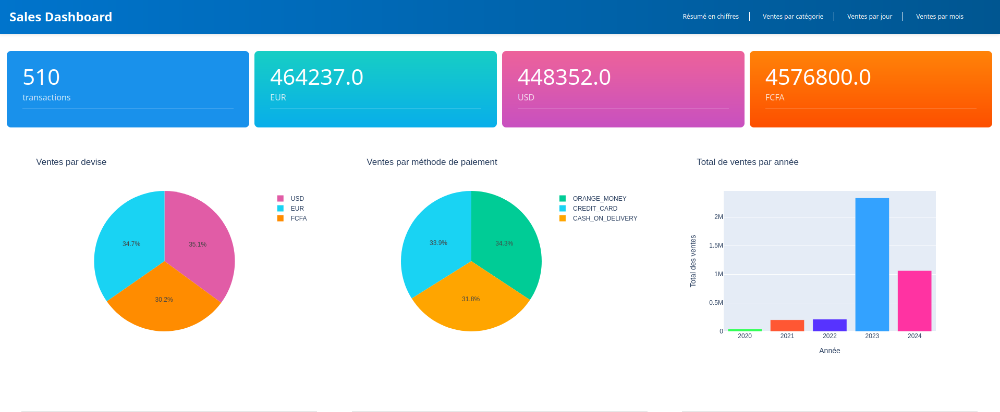
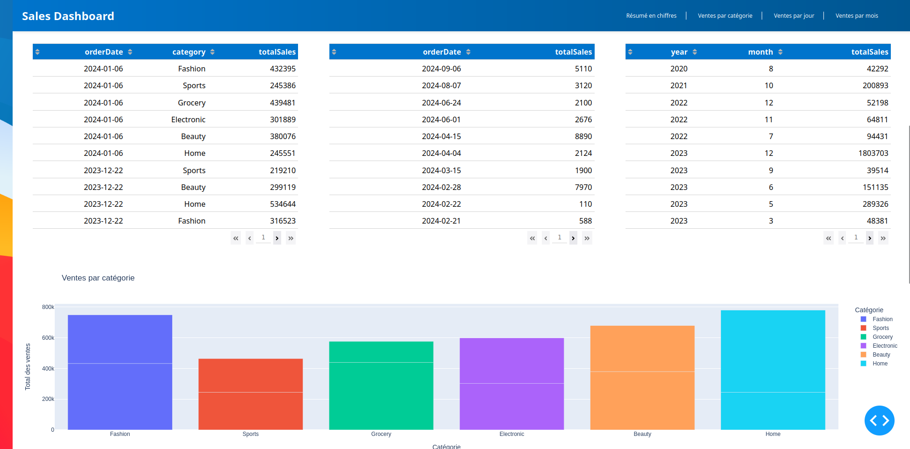
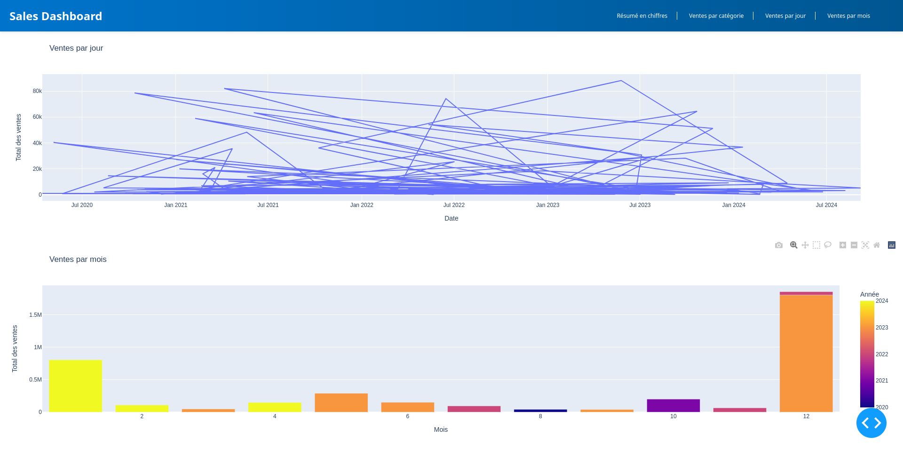

# Tableau de Bord des Ventes

## Aperçu

Ce script Python utilise le framework Dash pour créer un tableau de bord interactif affichant divers graphiques basés
sur les données provenant d'une base de données PostgreSQL. Les graphiques incluent des informations sur les ventes par
catégorie, par jour, par mois, par devise, par méthode de paiement, et le total des ventes par année.

## Dépendances

- dash
- pandas
- plotly.express
- plotly.graph_objs
- psycopg2

Assurez-vous d'avoir installé ces dépendances avant d'exécuter le script.

## Configuration de la Base de Données

La configuration de la connexion à la base de données PostgreSQL est définie dans le dictionnaire `db_config` comprenant
l'hôte, la base de données, l'utilisateur, et le mot de passe.

```python
db_config = {
    'host': 'localhost',  # par default 
    'database': 'your_db_name',
    'user': 'your_username',
    'password': 'your_password',
}
```

## Fonctions pour Récupérer les Données

Plusieurs fonctions sont définies pour récupérer des données spécifiques depuis différentes tables de la base de
données. Ces fonctions utilisent la bibliothèque psycopg2 pour établir une connexion à la base de données et exécuter
des requêtes SQL.

## Mise en Page de l'Application

La mise en page de l'application est définie à l'aide d'éléments HTML et de composants Dash tels que `html.Div`
, `dcc.Graph`, et `dcc.Interval`.

## Callbacks

Des callbacks sont utilisés pour mettre à jour dynamiquement le contenu du tableau de bord à intervalles réguliers. Ils
récupèrent les données depuis la base de données et mettent à jour les graphiques et les cartes en conséquence.

## Exécution du Script

Exécutez le script Python pour lancer l'application Dash avec la commande :

```bash
python main.py
```

## Captures d'ecran sortie





## Contributions

Les contributions sont les bienvenues ! Si vous avez des idées d'améliorations, veuillez ouvrir une issue ou soumettre
une demande de fusion.

## Auteurs

    Nom : Mohamed DIALLO
    email : mohameddiallo728@gmail.com

## Licence

Ce projet est sous licence MIT - voir le fichier [LICENSE](https://opensource.org/licenses/MIT) pour plus de détails.

La licence MIT est une licence open source permissive qui permet une utilisation, modification, et distribution libre du
code source. Elle est souvent utilisée pour les projets open source, car elle offre une grande liberté aux utilisateurs
tout en protégeant les droits d'auteur et la responsabilité de l'auteur du code.

[Lire la licence MIT](https://opensource.org/licenses/MIT)

