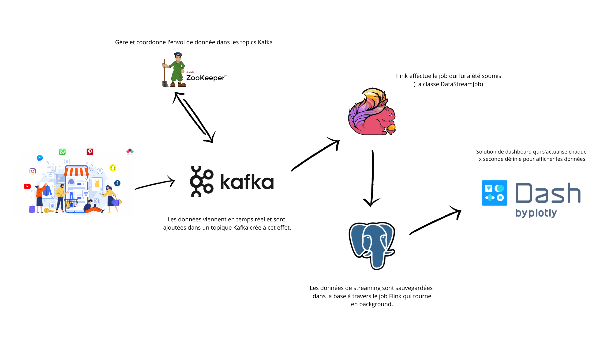

# Realtime Sales Analytics

## Introduction

Ce projet combine trois modules pour créer une solution complète d'analyse en temps réel des ventes. Les trois modules
sont les suivants :

1. **DataKafka** : Générateur de Transactions de Vente Simulées
2. **ecom** : Traitement en Temps Réel des Ventes utilisant Apache Flink
3. **Dashboard** : Tableau de Bord des Ventes

## DataKafka (Générateur de Transactions de Vente Simulées)

Le générateur de transactions produit des données simulées de ventes et les publie sur le topic Kafka "product_sold".
Ces données simulées servent de source pour le module de traitement en temps réel.

## ecom (Flink - Traitement en Temps Réel des Ventes)

Le module ecom utilise Apache Flink pour traiter les données en temps réel provenant du topic Kafka "product_sold". Les
transactions sont agrégées et mises à jour en continu dans la base de données PostgreSQL. Cette approche permet
d'obtenir des informations en temps réel sur les ventes et les catégories de produits.

## Dashboard (Tableau de Bord des Ventes)

Le module de tableau de bord utilise Dash, un framework Python, pour créer une interface web interactive. Le tableau de
bord s'actualise automatiquement toutes les deux secondes pour refléter les changements en temps réel dans les données
de vente. Cela offre une visualisation dynamique des performances de vente par catégorie, jour, mois, et plus encore.

## Configuration et Exécution

Avant de compiler et exécuter le projet, assurez-vous de configurer les informations nécessaires dans les fichiers
appropriés. Veuillez consulter les README respectifs de chaque module pour des instructions détaillées :

- [DataKafka - Générateur de Transactions de Vente Simulées](./DataKafka/README.md)
- [ecom - Traitement en Temps Réel des Ventes](./ecom/README.md)
- [Dashboard - Tableau de Bord des Ventes](./Dashboard/README.md)

## Contributions

Les contributions sont les bienvenues ! Si vous avez des idées d'améliorations, veuillez ouvrir une issue ou soumettre
une demande de fusion.

## Auteurs

    Nom : Mohamed DIALLO
    email : mohameddiallo728@gmail.com

## Licence

Ce projet est sous licence MIT - voir le fichier [LICENSE](https://opensource.org/licenses/MIT) pour plus de détails.

La licence MIT est une licence open source permissive qui permet une utilisation, modification, et distribution libre du
code source. Elle est souvent utilisée pour les projets open source, car elle offre une grande liberté aux utilisateurs
tout en protégeant les droits d'auteur et la responsabilité de l'auteur du code.

[Lire la licence MIT](https://opensource.org/licenses/MIT)
